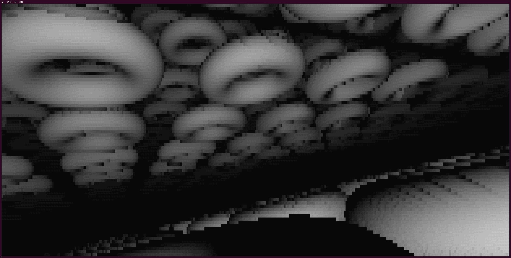

### This was made in an afternoon because I enjoy making raymarchers in various languages

To compile with gcc run `gcc raymarchingDonuts.c -o raymarchingDonuts -lX11 -lm -Wall`

To modify the scene modify the SDF at `float SDF(float *a)`

